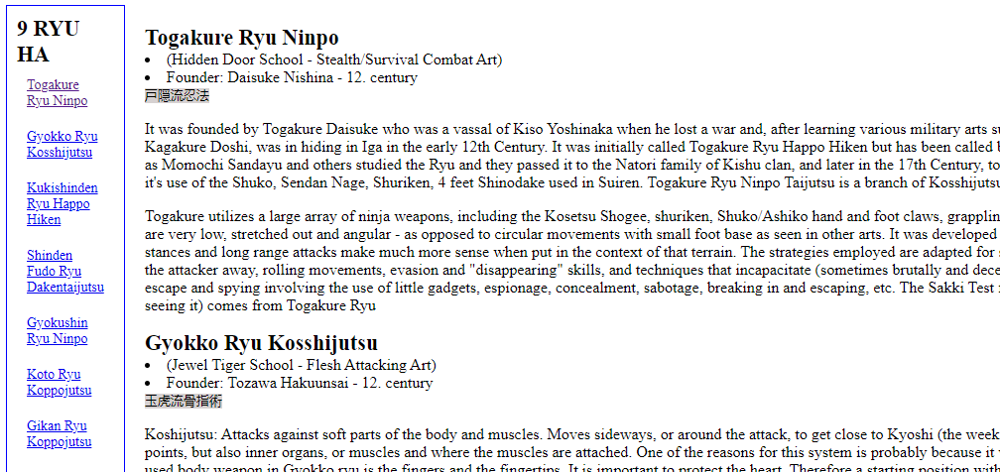

<h1 align="center">Technical Documentation Page</h1>

 

  

## 🚀 Tecnologies

This project was developed with:

- HTML 
- CSS 

## 💻 Project

Technical documentation page about the 9 ryuhas(traditions) of ninjutsu(art of the 'nin').

---

No Copyright :wave: by https://www.freecodecamp.org

- [Access the finished project, online](https://rodrigocccesar.github.io/technical_documentation)

